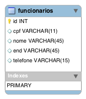
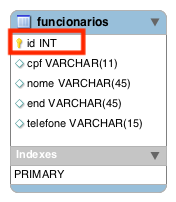
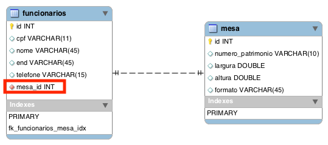
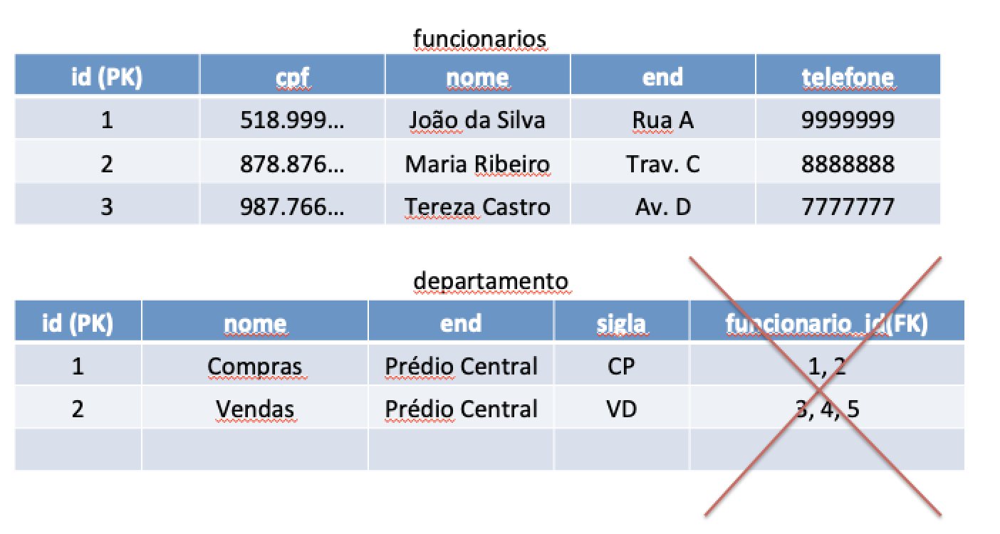
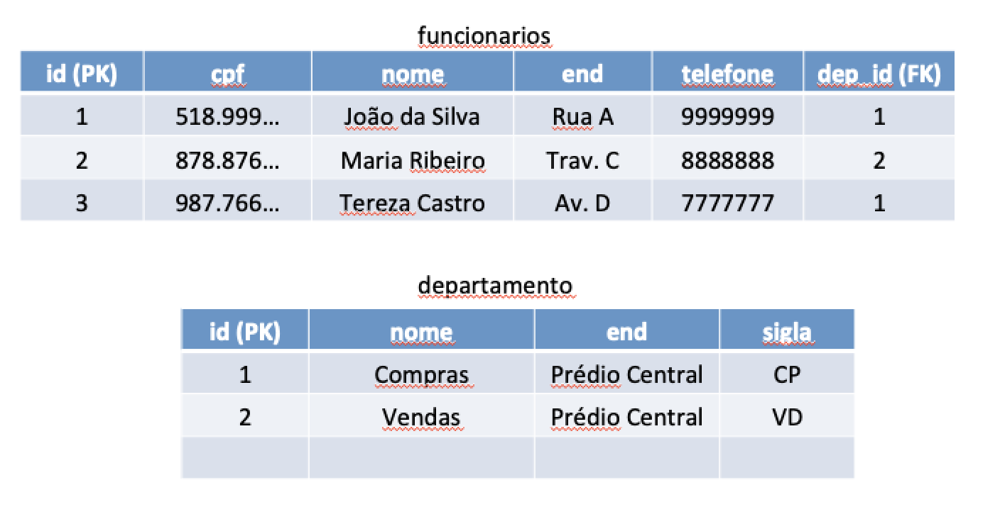
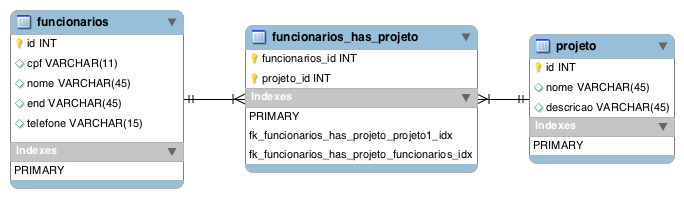
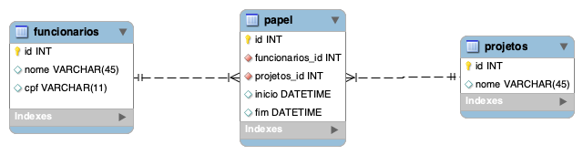

# Atividade

Pesquisa de 2 páginas sobre Sistema Gerenciador de Banco de Dados. 

Definição, características principais, principais softwares. 

obs: plágio é zero.

submissão no sigaa.

# Tabela

Em um banco de dados relacional as informações são armazenadas em *tabelas*, ou relações, ou entidades.  

Uma tabela é compostas por linhas (registros ou tuplas) e colunas (atributos). As linhas representam as informações de um item ou individuo, ex: em uma tabela de livros, cada linha representa um livro diferente. 

As colunas representam as informações relevantes sobre o determinado livro, ex: ISBN, título, quantidade de páginas, etc.

Ex: na Figura a baixo temos a tabela *funcionarios* na representação visual utilizada pela ferramenta MySQL Workbench, com os seguintes campos: id, cpf, nome, end, telefone. 

# Chave Primaria

Chave primária é um coluna com características especiais, ela não pode ser nula (null) e não pode se repetir. É utilizada para identificar/diferenciar as diversas instâncias de uma tabela. Ex: numa tabela de alunos, a matrícula poderia ser utilizada como chave primária para diferenciar os alunos.

Ex: na tabela funcionários a chave primária é a coluna *id*, uma chave artificial não tem qualquer relação com o domínio. O que é considerado uma boa prática.

# Relacionamentos

Entidades/tabelas não ficam isoladas, é necessário que ocorra ligação entre as mesmas. Ex: é necessário saber quais as disciplinas de determinado aluno, ou os projetos de determinado funcionário. O relacionamento entre tabelas é a maneira de ligar as informações dessas tabelas. O relacionamento entre duas tabelas/entidades acontece quando existe uma coluna em comum entre as duas. 

Existem basicamente 3 tipos de relacionamentos: 1:1, 1:N e N:N

# 1:1

Acontece quando uma entidade da tabela A se relaciona com apenas uma entidade da tabela B. Ex: na empresa X, cada funcionário possui sua estação de trabalho (notebook) e esta estação é exclusiva desse funcionário.

No caso do relacionamento 1:1, tanto faz onde a chave estrangeira está. 

# Chave Estrangeira

"Uma chave estrangeira é um campo, que aponta para a chave primária de outra tabela ou da mesma tabela. Ou seja, passa a existir uma relação entre duplas de duas tabelas ou de uma única tabela. A finalidade da chave estrangeira é garantir a integridade dos dados referenciais, pois apenas serão permitidos valores que supostamente vão aparecer na base de dados."
[ref](https://pt.wikipedia.org/wiki/Chave_estrangeira)

.png)

# 1:N
No relacionamento 1:N, a localização da chave é importante. Colocar na tabela errada compromete o modelo. Ex: no relacionamento entre funcionários e departamentos, um departamento é composto pode diversos funcionários, porém um funcionário pertence apenas a um departamento.

Dá maneira como está projetado na tabela a baixo, o departamento pode ter apenas 1 funcionário. O que é conceitualmente errado.

.png)

Versão expandida, com valores.

O modelo correto seria.

.png)

Modelo correto expandido, com valores.

# N:N

Nas situações onde existe a relação muitos para muitos, é necessário criar uma tabela. Ex: um funcionário pode participar de vários projetos e um projeto contém em sua equipe diversos funcionários. 

# N:N (entidade)

Em algumas situações específicas quando a tabela intermediária possui atributos além das chaves de ligação esta passa a ter vida própria se tornando uma entidade independente.

# Obs: diferença entre linha continua e pontilhada

A linha contínua é utilizada quando uma chave estrangeira é chave primária na outra tabela

# Exercício

- Um Aluno (id, matricula, nome) está inscrito em um curso (id, sigla, nome)
- Um curso tem diversos alunos
- Um curso tem varias disciplinas (id, nome, ch)
- Disciplina pertence apenas a um curso
- Um aluno faz varias disciplinas
- Uma disciplina tem varios alunos associados
- Disciplina tem apenas um professor (id, cpf, nome)
- Professor pode ministrar varias disciplinas
