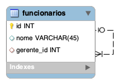

# Auto-relacionamento

Este tipo de relacionamento ocorre toda a vez que temos uma ocorrencia de uma entidade que está associada a um ou mais ocorrencias da mesma entidade. Ou seja, temos uma entidade onde suas ocorrencias possuem relacionamentos entre si.

Os auto-relacionamentos são na verdade uma forma de representarmos relações de hierarquia entre ocorrencias de uma mesma entidade. 

Por exemplo, vamos considerar uma entidade funcionário sendo que no modelo devemos representar o conceito de que um funcionário possui um gerente. Ou seja, existe um relacionamento entre as ocorrencias da entidade funcionário que estabelece que um funcionário é gerente de outro funcionário.  Veja o exemplo abaixo de como deve ser representado este relacionamento:

# Exercício

## Descrição do problema: Empresa

- Nesta empresa existe diversos departamentos (id, nome), nestes departamento existem diversos funcionários (nome, cpf, end, telefone), porém um funcionário pertence a apenas  um departamento;
- Um departamento possui um chefe (funcionario);
- Cada funcionário possui um supervisor, esta relação não tem influência do departamento em que este funcionário pertence.
- Cada funcionário está alocado em uma sala (nome, m2, numero e localização), podendo dividir essas sala com mais funcionários;
- Os funcionários participam simultaneamente de projetos (id, nome, valor) diferentes;
- Cada funcionário tem um cargo (descricao, salario) definido, e automaticamente um salário correspondente;
- Cada sala está relacionada a um prédio (nome);

