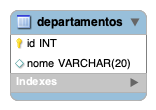
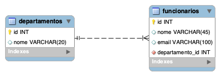

# SQL Funcionando

Como transformar a tabela para SQL.

Criando o schema/database o banco do projeto
```sql
create schema aula;

use aula;
```

## Baseado no diagrama criar a tabela no banco



criando a tabela departamentos:

```sql
create table departamentos(
	id int primary key,
	nome varchar(20)
);
```

realizando um insert na tabela:

```sql
insert into departamentos values (1, 'TI');

insert into departamentos values (2, 'Financeiro');

insert into departamentos values (3, 'Compras');
```

checando se os dados está no banco:

```sql
select * from departamentos;
```

## Criando a tabela funcionários que tem relacionamento 1:N com departamentos



criando a tabela funcionarios com relacionamento

```sql
create table funcionarios(
	id int primary key,
	nome varchar(45),
	email varchar(100),
    departamento_id int,
    foreign key (departamento_id) references departamentos(id)
);
```

inserts na tabela funcionarios:

```sql

-- insert into funcionarios values (1, 'Mario', 'mario@gmail.com', 4);
insert into funcionarios values (1, 'Mario', 'mario@gmail.com', 1);
insert into funcionarios values (2, 'Tereza', 'tereza@gmail.com', 2);
insert into funcionarios values (3, 'Felipe', 'felipe@gmail.com', 3);
insert into funcionarios values (4, 'Fabio', 'fabio@gmail.com', 1);
insert into funcionarios values (5, 'Jose', 'jose@gmail.com', 2);
insert into funcionarios values (6, 'Antonio', 'antonio@gmail.com', 3);
insert into funcionarios values (7, 'Paula', 'paula@gmail.com', 1);

```

checando se os dados da tabela:

```sql
select * from funcionarios;
```

## Fazendo um join

Selecionando todas as informações dos funcionarios e departamentos, do departamento TI

```sql
select * from funcionarios, departamentos where departamentos.id = funcionarios.departamento_id and departamentos.nome = 'TI'; 
```

Selecionando apenas os nomes

```sql
select funcionarios.nome, departamentos.nome from funcionarios, departamentos where departamentos.id = funcionarios.departamento_id and departamentos.nome = 'TI'; 
```