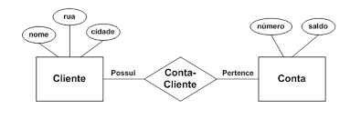
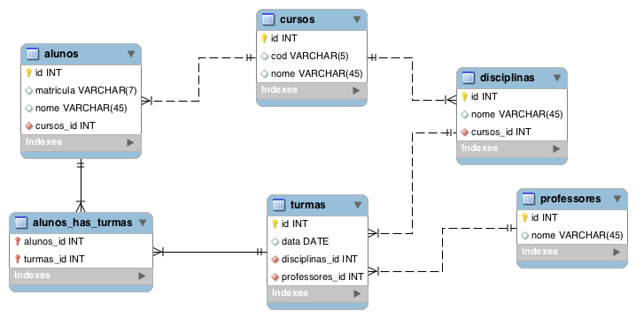

# Níveis da Modelagem
A cada um desses níveis de modelagem serão associadas técnicas de representação gráfica e métodos e de especificação de schemas.

## Modelo Conceitual de Dados
Aquele em que os objetos, suas características e relacionamentos têm a representação fiel ao ambiente observado, independentemente de quaisquer limitações imposta por tecnologias, técnicas de implementação ou dispositivos físicos. Separa o problema de modelagem do problema de implementação do modelo em um tipo de SGBD específico. Permite abstrair e compreender melhor o ambiente observado. Geralmente utilizado para conversar com pessoas com pouco domínio técnico como cliente da aplicação.

## Modelo Lógico de Dados
Aquele em que os objetos, suas características e relacionamentos têm a representação de acordo com as regras de implementação e limitações impostas por algum tipo de tecnologia. Essa representação é independente dos dispositivos ou meios de armazenamento físico das estruturas de dados por elas definidas. Modelo relacionado ao projeto de banco de dados.

## Modelo Físico de Dados
É a representação dos objetos feita sob o foco do nível físico de implementação das ocorrências, ou instâncias das entidades e seus relacionamentos. O conhecimento do modo físico de implementação das estruturas de dados é ponto básico para o domínio desse tipo de modelo. 

# Diagrama Entidade Relacionamento

o que representa cada simbolo:

# Diagrama Entidade Relacionamento Estendido

especialização:

# Enhanced Entity Relationship - EER 

O MySQL Workbench é um programa de design de diagrama EER, que é a representação visual da estrutura do banco de dados. Que geralmente ignora os valores das linhas, e foca nas tabelas colunas e relacionamentos.

É um diagrama físico, que representa as tabelas reais do banco em vez de simbolos que podem gerar uma ou mais tabelas. Cada entidade reflete a uma tabela real no banco e cada campo a uma coluna.

# Referências
- https://cacoo.com/blog/er-diagrams-vs-eer-diagrams-whats-the-difference/

- https://cacoo.com/blog/er-diagrams-vs-eer-diagrams-whats-the-difference/

- https://www.lucidchart.com/pages/pt/diagrama-entidade-relacionamento-estendido

- https://www.calebcurry.com/introduction-to-mysql-workbench/